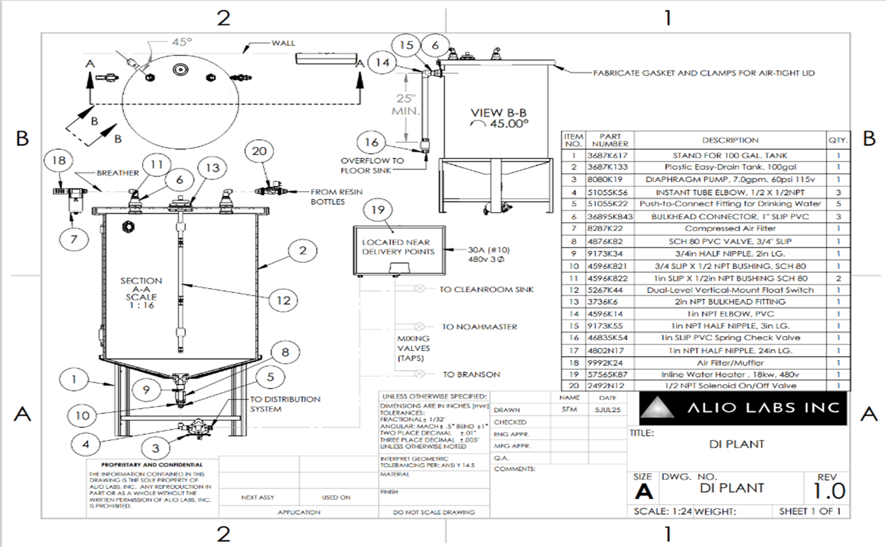
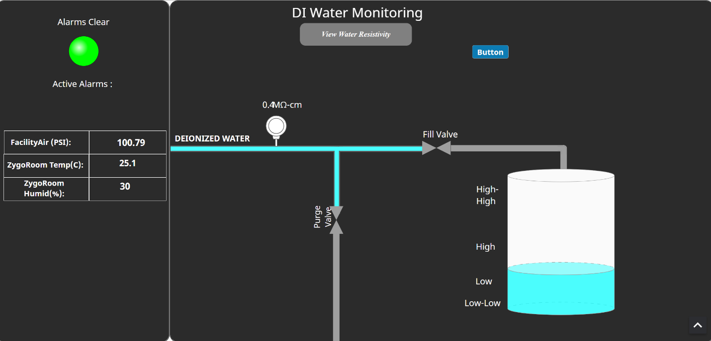
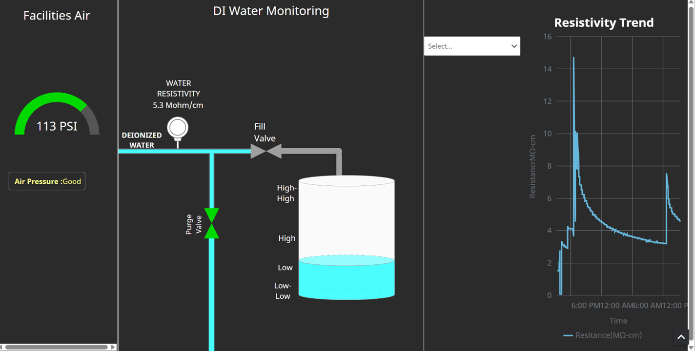
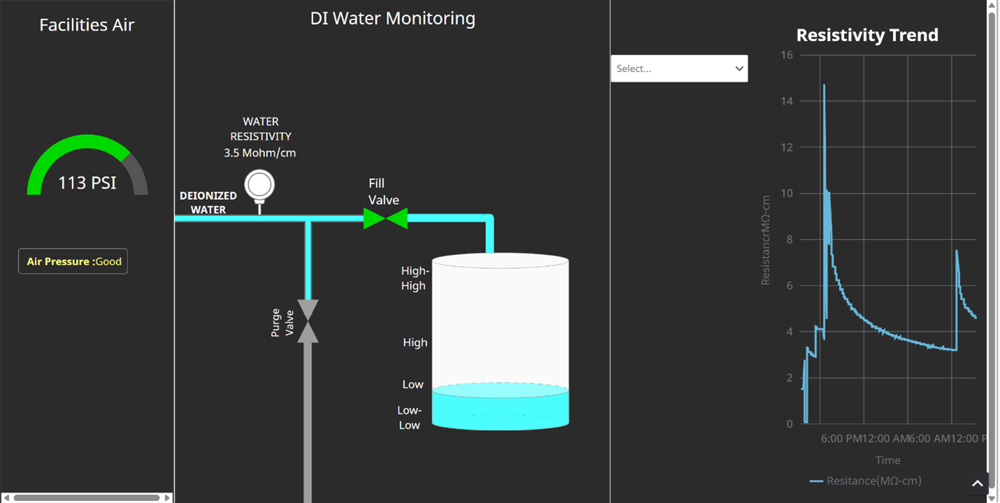
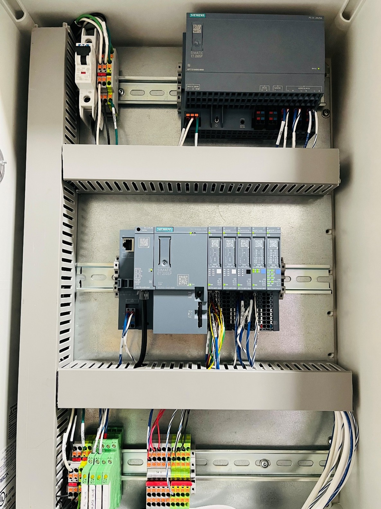

# SCADA System for DI Water Monitoring and Automation

## Overview

This project was developed during my automation internship and focuses on designing a PLC-SCADA system to automate DI water tank filling and monitor utility conditions.

The system integrates sensors, PLC control logic, and an HMI to monitor:

* DI water tank levels
* Water resistivity
* Facility air pressure, temperature, humidity
* System alarms and safety conditions

## Problem

The facility required a reliable system to manage and monitor critical utilities, including DI water used for glass substrate cleaning and air pressure within the room. High-resistivity DI water was essential to ensure proper cleaning before coating processes.

There was no integrated automation system to:

* Control DI water tank filling
* Monitor water quality (resistivity)
* Detect abnormal tank levels or leaks
* Monitor facility air pressure
* Provide centralized visualization for operators

## My Contribution

During my internship, I designed and implemented a complete PLC-SCADA based automation system for monitoring and controlling facility utilities.

### System Design & Implementation

* Developed full control logic for DI water tank automation using **Siemens S7-1500 (CPU 1510SP-1 PN) PLC**
* Integrated multiple field sensors including:

  * Float sensors for High, High-High, Low, and Low-Low tank levels
  * Beckman resistivity sensor (0–10 V analog output)
  * Pressure transmitter for facility air pressure monitoring
  * Leak detection sensors for safety
  * Configured relays and solenoid valves for purge and fill operations

### Control Logic Development

* Designed a **purge-before-fill sequence** to improve water resistivity
* Implemented automatic filling based on tank level conditions
* Added fail-safe interlocks:

  * High-High overflow protection
  * Low-Low dry-run / leak protection
  * Integrated manual override (purge push-button)

### Signal Processing & Calibration

* Implemented analog signal scaling in PLC for:

  * Water resistivity (custom calibration due to lack of sensor documentation)
  * Air pressure (converted voltage to PSI)
  * Developed linear calibration model using experimental data

 ## Control Logic

The DI water tank operation is controlled using level-based logic with four float sensors: High-High, High, Low, and Low-Low.

### Automatic Filling Sequence

1. When the water level drops below the **Low** level, the PLC detects the condition.
2. The system first activates the **purge valve** for a fixed duration to remove low-quality water and improve resistivity.
3. After the purge cycle, the purge valve is closed.
4. The **fill valve** is then activated to refill the tank.
5. Filling continues until the **High** level is reached.
6. At High level, the PLC stops the filling process.

### Safety & Interlocks

* **High-High Level Protection**
  If the High sensor fails, the High-High level triggers an alarm and immediately stops the system to prevent overflow.

* **Low-Low Level Protection**
  If the tank continues to drain or a leak occurs, the Low-Low level triggers an alarm and halts operation.

* **Leak Detection**
  Additional leak sensors are integrated to detect abnormal water presence and trigger alarms.

### Manual Control

* A **manual purge push-button** allows operators to trigger additional purge cycles when needed.

This control strategy ensures reliable tank operation, improved water quality, and safe system behavior under fault conditions.

### SCADA & HMI Development

* Built an HMI using **Ignition SCADA** for real-time monitoring
* Visualized:

  * Tank levels
  * Valve status (purge/fill)
  * Air pressure with alarms
  * Resistivity trends

### System Extensions

* Added **IO-Link based temperature and humidity monitoring** in a separate room using:

  * Siemens ET200eco PN IO-Link Master
  * PROFINET communication with PLC
  * Implemented filter exhaustion detection by extracting LED signal and integrating it into PLC logic
* Developed alarm indication using external signal tower
* Configured alarm notification pipeline in SCADA for leak detection events

## System Visualization

### DI Water System Overview

### HMI & Operation

#### Purge Valve Active

#### Fill Valve Active

### PLC Control Panel

## Engineering Details

### PLC Platform
The control system was implemented using a **Siemens S7-1500 PLC (CPU 1510SP-1 PN)** with distributed I/O for integrating float sensors, analog transmitters, leak sensors, relays, and solenoid valves.

### Field Devices Integrated
- **Float sensors** for High-High, High, Low, and Low-Low tank level detection
- **Beckman resistivity sensor** with 0–10 V analog output
- **Pressure transmitter** for facility air pressure monitoring
- **Leak sensors** for abnormal water detection
- **Solenoid valves** for purge and fill control
- **Manual purge push-button**
- **Ignition SCADA HMI** for visualization and alarms

### Process Logic
The DI water tank uses level-based control with a purge-before-fill sequence:

- When the tank level drops to **Low**, the PLC starts a timed purge cycle
- After purge completes, the PLC opens the fill valve
- Filling continues until the **High** level is reached
- **High-High** and **Low-Low** conditions act as fault/interlock states
- Leak detection also triggers alarm handling and stops normal operation when required

### Analog Signal Scaling
Analog signals were scaled inside the PLC to convert raw voltage values into engineering units.

#### Air Pressure Scaling
The facility pressure transmitter provides a **0–10 V** signal. The PLC scales this signal into **PSI** for monitoring and alarm generation.

General linear scaling form:

Pressure = ((RawVoltage - MinVoltage) / (MaxVoltage - MinVoltage)) * (MaxPressure - MinPressure) + MinPressure

For a 0–10 V transmitter:
Pressure = (RawVoltage / 10.0) * FullScalePressure

This scaled value is then compared against alarm thresholds for low and high pressure conditions.

#### Resistivity Scaling
The resistivity sensor also provides a **0–10 V** analog output. Because direct sensor documentation was limited, an experimental calibration approach was used.

A linear equation was developed from measured voltage and resistivity data:

Resistivity = m × Voltage + b

Where:
- **m** = slope from calibration data
- **b** = offset from calibration data

This allowed the PLC to convert raw analog input values into usable resistivity readings for monitoring and trending.

### Safety and Interlocks
The control strategy included multiple fail-safe protections:

- **High-High alarm** to prevent overflow
- **Low-Low alarm** to prevent unsafe operation during low water or leak conditions
- **Leak sensor alarm integration**
- **Manual reset requirement** after alarm conditions

### SCADA / HMI Functions
The Ignition HMI was used to provide operators with real-time visibility of:

- Tank level states
- Purge and fill valve status
- Air pressure readings
- Resistivity trends
- Alarm conditions

